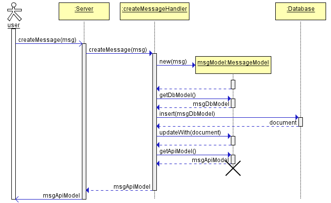

# Basic Messages Application
Simple application that allows users to submit messages, retrieve them, and delete them. A *message* is a simple object containing content and ID. Moreover, user can ask whether the message is a palindrome.

**WARNING:** This application is written as an assignment. The stored messages will be deleted on server restart. There is no user authentication.

*Note:* cURL examples and command line instructions in this documentation are based on Windows.

<br />

Table of Contents
-----------------
[**REST APIs**](#rest)

[**Run Application Locally**](#runlocal)

[**Provision and Deploy to AWS**](#deploy)

[**Description of Implementation Architecture**](#architecture)

[**Usecase Sequence Diagrams**](#sequence)

[**TODO List**](#todo)

[**License**](#license)

<br />

<a name="rest"></a>
## REST APIs

*Note:* The cURL command examples in this section all use *'localhost:3000'* URL based on assumption that you are running the application locally with default settings (explained in [Run Application Locally](#runlocal)). Adjust if this assumption is not correct.

To follow these examples, get cURL from: [https://curl.haxx.se/download.html](https://curl.haxx.se/download.html)

<br />

<a name="obj"></a>
### **Message Object**
A message object sent or received to/from APIs contains a content and an id. The JSON representation of a message is as follows:
```json
{
    "messageContent" : "string",
    "messageId" : "string"
}
```
Where:

*"messageContent"* is a string of length more than 0 and less than or equal 255 characters. There is no requirement on having unique message contents.

*"messageId"* is a UUID string.

*"messageId"* is ignored if passed in when creating a new message. It will be generated by the application, not accepted from user.

<br />

<a name="post"></a>
### **Submit a New Message**
Define your message in JSON format as explained in [Message Object](#obj). For example:
```json
{
    "messageContent":"my first message"
}
```
The call to create the message looks like this:
```
curl -i -X POST -H "Content-type: application/json" -d "{\"messageContent\":\"my first message\"}" http://localhost:3000/api/v1/messages
```

Alternatively, if you save the JSON representation in a file named msg.json you may perform following:
```
curl -i -X POST -H "Content-type: application/json" -d @msg.json http://localhost:3000/api/v1/messages
```

Either way, here is a sample response from server upon success:
```json
HTTP/1.1 201 Created

{"messageContent":"my first message","messageId":"6d140eb0-81ba-11e6-baa1-3f31e0b78789"}
```
Take a note of the value of returned *"messageId"* for the rest of operations.

If an error ocurrs, you may see a status code other than 201 with an error object returned in response body. For example, the following response is received if content-type header is not application/json:
```json
HTTP/1.1 415 Unsupported Media Type

{"message":"Content-type must be application/json"}
```
Another example of user error is providing a non-string `messageContent` or if the length is 0 or more than 255. In this case, following error is returned:
```
HTTP/1.1 400 Bad Request

{"code":"EU101","message":"The object must have a property of \"messageContent\" of type string with length more than zero and less than 255"}
```
The *"code":"EU101"* is an error code to be able to troubleshoot easily and narrow down the problem when investigating defects or customer problems.

The list of error codes can be found in [Error Codes](src/server/helpers/errorCodes.js).


<br />

<a name="getall"></a>
### **Retrieve All Messages**

The call to retrieve all messages looks like this:
```
curl -i -X GET http://localhost:3000/api/v1/messages
```
This is a sample response when there are two messages created so far:
```json
HTTP/1.1 200 OK

[
    {"messageContent":"my first message","messageId":"6d140eb0-81ba-11e6-baa1-3f31e0b78789"},
    {"messageContent":"Madam, I'm Adam","messageId":"d5af3b70-81ba-11e6-9537-35e83f3424bd"}    
]
```

<br />

### **Retrieve a Message**

To retrieve a message, you need its ID which is the value of *"messageId"* property returned as part of response when the message was first created (as in [Submit a New Message](#post)). Alternatively, you may get IDs of all existing messages by retrieing all messages (as in [Get All Messages](#getall)).

The API syntax to get a message is:
```
curl -i -X GET http://localhost:3000/api/v1/messages/<messageId>
```

For example, the call to retrieve the message we created as example in [Submit a New Message](#post) looks like this:
```
curl -i -X GET http://localhost:3000/api/v1/messages/6d140eb0-81ba-11e6-baa1-3f31e0b78789
```
And the response is:
```json
HTTP/1.1 200 OK

{"messageContent":"my first message","messageId":"6d140eb0-81ba-11e6-baa1-3f31e0b78789"}
```

If an invalid/nonexisting ID is specified, a **_404 Not Found_** status code and an error message is returned:
```json
HTTP/1.1 404 Not Found

{"code":"EU100","message":"Failed to retreive message(s)"}
```

<br />

#### **Determine if a Message is a Palindrome**

To determine whether a message is a palindrome, use the following syntax:
```
curl -i -X GET http://localhost:3000/api/v2/messages/<messagId>/palindrome
```
For example, the following are api request and responses to get whether our *"my first message"* is a palindrome:
```
curl -i -X GET http://localhost:3000/api/v2/messages/6d140eb0-81ba-11e6-baa1-3f31e0b78789/palindrome
```
```json
HTTP/1.1 200 OK

{"messageContent":"my first message","messageId":"6d140eb0-81ba-11e6-baa1-3f31e0b78789","isPalindrome":false}
```

An older version of this api (v1) is as follows:

API syntax:
```
curl -i -X GET http://localhost:3000/api/v1/messages/<messagId>/palindrome
```

When the message is a palindrome, this version returns status code of **_204 No Content_**. When the message is not a palindrome, this version returns status code of **_422 Unprocessable Entity_**.


For example, calling this api on message with content *"Madam, I'm Adam"* is as follows:
```
curl -i -X GET http://localhost:3000/api/v1/messages/d5af3b70-81ba-11e6-9537-35e83f3424bd/palindrome
```
```json
HTTP/1.1 204 No Content
```

And, calling this api on message with content *"my first message"* is as follows:
```
curl -i -X GET http://localhost:3000/api/v1/messages/6d140eb0-81ba-11e6-baa1-3f31e0b78789/palindrome
```
```json
HTTP/1.1 422 Unprocessable Entity
```

In both API versions, if an invalid/nonexisting ID is specified, a **_404 Not Found_** status code and an error message is returned:
```json
HTTP/1.1 404 Not Found

{"code":"EU100","message":"Failed to retreive message(s)"}
```


<br />

### **Delete a Message**

To delete a message, you need its ID which is the value of *"messageId"* property returned as part of response when the message was first created (as in [Submit a New Message](#post)). Alternatively, you may get IDs of all existing messages by retrieing all messages (as in [Get All Messages](#getall)).

The API syntax to delete a message is:
```
curl -i -X DELETE http://localhost:3000/api/v1/messages/<messageId>
```

For example, the call to delete the message we created as example in [Submit a New Message](#post) looks like this:
```
curl -i -X DELETE http://localhost:3000/api/v1/messages/6d140eb0-81ba-11e6-baa1-3f31e0b78789
```
And the response is:
```json
HTTP/1.1 204 No Content
```

If an invalid/nonexisting ID is specified, a **_404 Not Found_** status code and an error message is returned:
```json
HTTP/1.1 404 Not Found

{"code":"EU100","message":"Failed to retreive message(s)"}
```

<br />

<a name="runlocal"></a>
## Run Application Locally

Follow the instructions in this section to get the project up and running on your local machine for development. 


### **Prerequisities**
* Install NodeJs from: [https://nodejs.org/en/download/](https://nodejs.org/en/download/)
* Create an account in Cloudant: [https://cloudant.com/](https://cloudant.com/)

<a name="envvars"></a>
### **Set Environment Variables**
Open command line and set following environment variables based on your Cloudant account. The database name is anything you want, just stick to Cloudant rules (e.g. only lower case).

Keep this command line open for the rest of instructions, the variables are set only for this session.

```
set DATABASE_NAME=yourdbname
set DATABASE_USER=yourusername
set DATABASE_PASS=yourpass
```
Where *yourdbname*, *yourusername*, *yourpass* are replaced with your own values.

### **Build and Run**
* Change directory to the project folder 
* Run `npm install` - This will download all node packages.
* Run `npm run dev` - This will run the server and will watch any code changes you make.
* Watch the console, it will tell you when server is ready by printing `server listening on port 3000` 
* Execute any of API call examples in [REST APIs](#rest).

<br />

<a name="deploy"></a>
## Provision and Deploy to AWS

### **Prerequisities**
* Create Amazon account
* [Install the Elastic Beanstalk Command Line Interface (EB CLI)](https://docs.aws.amazon.com/elasticbeanstalk/latest/dg/eb-cli3-install.html)
* [Create access keys](http://docs.aws.amazon.com/general/latest/gr/managing-aws-access-keys.html)

### **Create an AWS Environment and Provision the Instance**

This step needs to be done only once for the project folder.
* Open command line and change directory to the project folder
* [Set Environment Variables](#envvars) - you may skip this step, if so, you will be asked to provide this information in next step
* Run provision.bat located in project folder and follow the prompts (this will also build project)

### **Deploy to Instance Again**

After making changes to the project, you can deploy the changes from your local machine as follows:
* Open command line and change directory to the project folder
* Run deploy.bat located in project folder (this will also build project)

<br />

<a name="architecture"></a>
## Description of Implementation Architecture

### Overview of Modules
* `controllers` folder contains API handlers. The folder structure contains the API version and resource name. 
* `database` contains `cloudantClient` which has the logic for connecting to and using the Cloudant database. The `designDocs` folder contains JSON files representing database views and indices.
* `helpers` has some helper or utility modules.
* `models` contains data model modules, explained in more details in [Data Models](#models).
* `public` contains images and files that can be served to client as a static file.
* `routes` contains routing modules, explained in [API Routing](#routes).
* `strings` contains globalization files for messages that will be sent to client. For example, `strings-en.js` contains messages in English. Future work is needed to include other languages and determine which file to use for getting value of a message by its key based on user lanaguage.

A note on `controllers`: Ideally the folder hierarchy should match the API path. For example, the handler for */api/v1/messages* is located under folder *messages* of *v1*. There is one exception, since */api/v1/message/:messageId/palindrome* is a special case for *messages* resource and there would be only one applicable HTTP verb (GET) an extra subfolder for palindrome seems unncessary. 

<a name="routes"></a>
### API Routing
Express framework's [routing module](https://expressjs.com/en/guide/routing.html) is used to route apis to their appropriate handlers. For each REST resource, e.g. messages, there should be a router defined under `src\server\routes` folder. The router for resource knows about its API versions and which handler to call for each version and HTTP verb.

<a name="models"></a>
### Data Models
All API resources are defined as data models that describe how the resource should look like to the client (by returning the client facing object in implementation of `getApiModel()` function). A data model can optionally also define how it should be persisted to the database (by returning the database object in implementation of `getPersistedModel()` function). For clarity, a super prototype is defined named `objectModel` that contains the signature for functions that each model can optionally implement. `objectModel` also contains the default (fall back) value that can be returned if the child decides not to implement a function.

The reason for separation of the object model's representation for client from its representation in database is that client must not see all details of an object that could be persisted. For example, a database ID does not have to be revealed to user. On the other hand, a resource seen by client isn't necessarily persisted to database. This separation also allows for versioning of API representations, while keeping database and application logic unaffected. 

Data models in this project are:
* `ErrorModel` which is the error object returned in case of failure. An object of this type is a valid API return value, crafted for readability for user which also contains an error code that helps drilling down into issues. Since an `ErrorModel` is only a resource returned by API calls in case of error, it doesn't implement the `getPersistedModel()` function meaning there is no database object equivalent to `ErrorModel`.
* `MessageModel` is the representation of a message resource that contains a `messageContent` and a `messageId`. Since a `MessageModel` needs to be both returned to client and persisted in database it needs to implement both `getApiModel()` and `getPersistedModel()` functions. 
* `PalindromeModel` is a data model that consists of (inherits) `MessageModel` object in addition to logic to determine whether the `messageContent` is a palindrome. `PalindromeModel` has an API representation which is obtained by calling `getApiModel()`, but it doesn't have any independent `getPersistedModel()`, only the included parent object (the `MessageModel`) is persistable. 

<br />

<a name="sequence"></a>
## Usecase Sequence Diagrams

### **Create a message**


### **Get a message**


### **Delete a message**


<br />

<a name="todo"></a>
## TODO List

[ ] Support https

[ ] Authentication

[ ] User interface

[ ] Tests

[ ] Etag

[ ] Response compression

[ ] Multitenancy

[ ] Pagination

[ ] Swagger

[ ] Log to file

<br />

<a name="license"></a>
## License

This project is licensed under the MIT License - see [LICENSE.txt](LICENSE.txt).